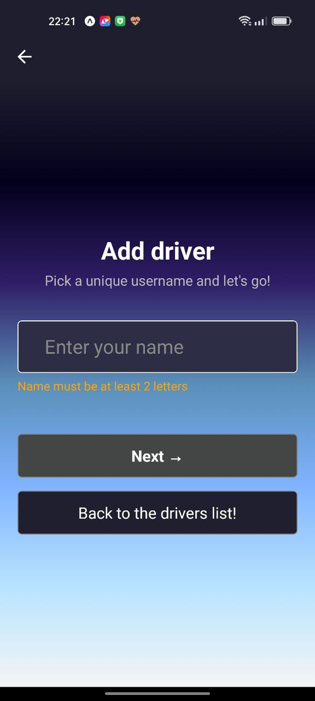
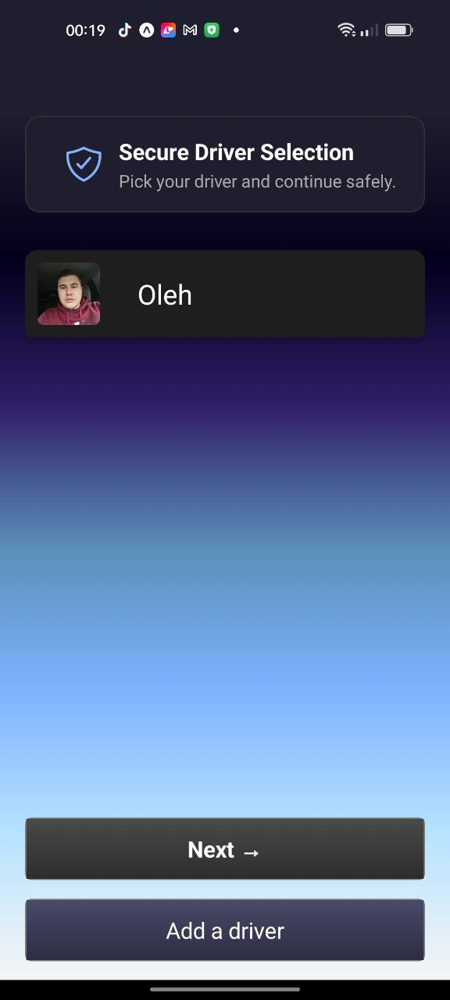
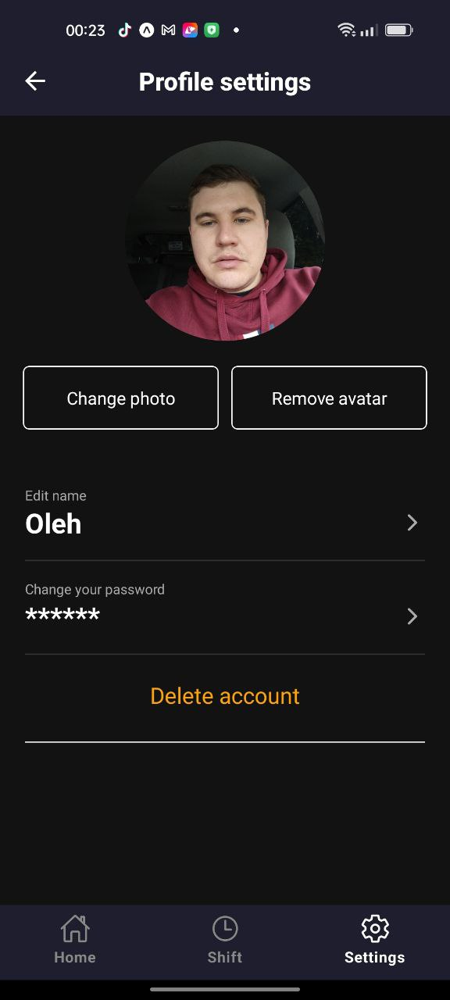
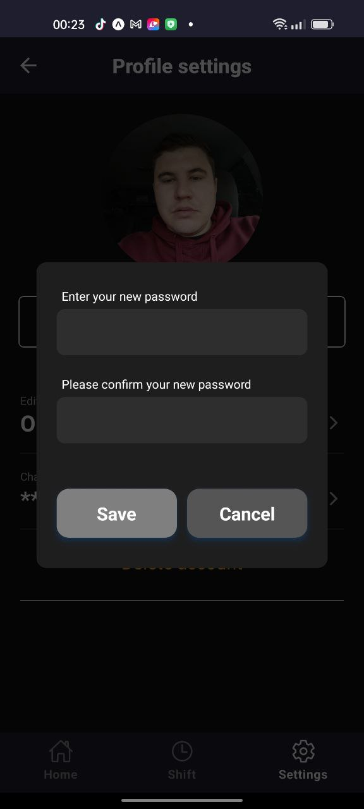
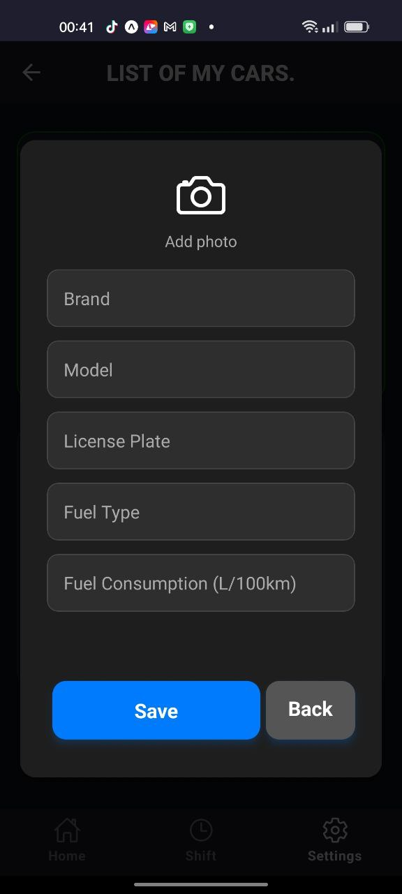
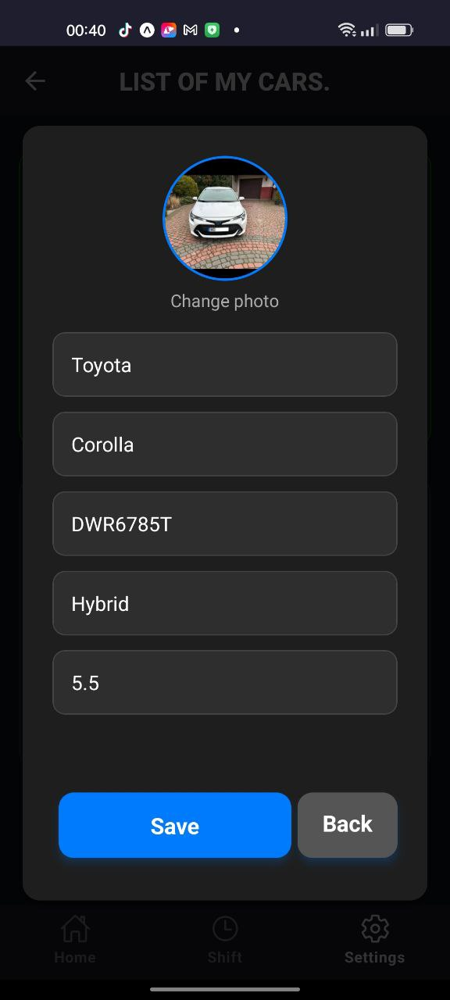
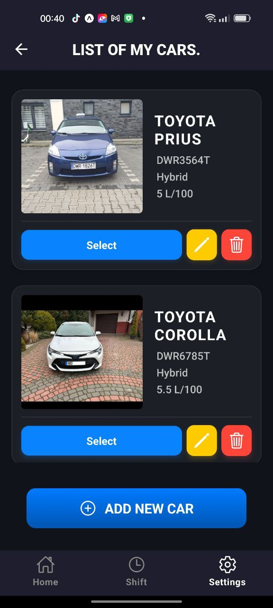
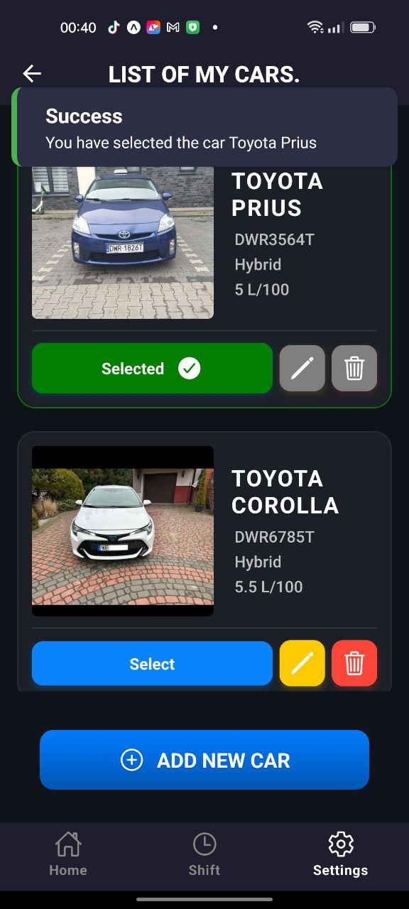
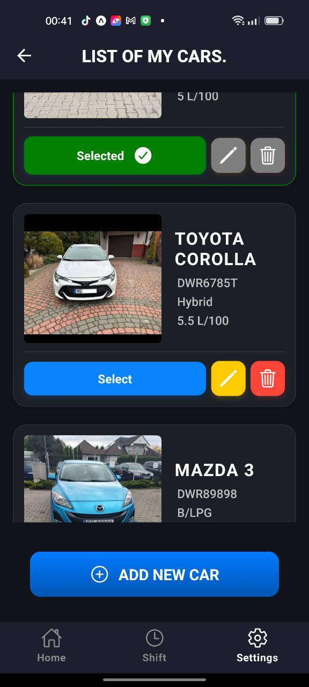

🌐 **Choose your language:**  
- 🇺🇸 **[ENGLISH](README.md)** 🔹  
- 🇵🇱 **[POLSKI](README_PL.md)** 🔹  
- 🇺🇦 **[УКРАЇНСЬКА](README_UA.md)** 🔹
  
---

# 🚖 Smart Taxi Tracker  
<details>
  <summary>What is Smart Taxi Tracker?</summary>

  🔹 **Seamless shift tracking** – Log your working hours, mileage, expenses, and manage your shifts effortlessly.  
  🔹 **Financial insights** – Stay on top of your income, expenses, and net profit.  
  🔹 **Driver & Vehicle Management** – Add multiple drivers and vehicles with detailed tracking per shift.  
  🔹 **Cross-platform support** – Built with **React Native & Expo**, delivering smooth performance on **iOS & Android**.  

  #### 📊 Take control of your work schedule, maximize your income, and simplify expense management with **Smart Taxi Tracker**!  

</details>

## 📲 Download aplication

📌 **[Download APK for Android](https://expo.dev/accounts/olopromotion/projects/TaxiHelper/builds/70a324b1-521e-4b73-ae30-a14f294d20f0)**
 
---
# 📸 Screenshots for a quick UI overview

## 📝 Registration Screens  

Explore the step-by-step registration process in **Smart Taxi Tracker.  

<details>
  <summary>1️⃣ Enter Your Name 🖊️</summary>
  <br>
  
</details>

<details>
  <summary>2️⃣ Set Your Password 🔒</summary>
  <br>
  
</details>

<details>
  <summary>3️⃣ Confirm Your Password ✅</summary>
  <br>
  
</details>

 ## 📝 Authentication Screens  

Follow the step-by-step authentication process in **Smart Taxi Tracker.  

<details>
  <summary>1️⃣ Select a driver from the list 🖊️</summary>
  <br>
  
  
  
</details>

<details>
  <summary>2️⃣ Set Your Password 🔒</summary>
  <br>
  
</details>

## 📝 Profile settings Screens  

Make changes to your name, password, and avatar, or delete your account..  

<details>
  <summary>1️⃣ Profile main screens 🖊️</summary>
  <br>
  
  
  
</details>

<details>
  <summary>2️⃣ Cnange name and password forms 🔒</summary>
  <br>
  
  
</details>

## 📝 My cars Screens  

Ability to add, edit, select, and open the car photo in full screen.  

<details>
  <summary>1️⃣ Add new car and edit 🖊️</summary>
  <br>
  
  
</details>

<details>
  <summary>2️⃣Selected car and list of my cars 🔒</summary>
  <br>
  
  
  
</details>

---

## 🔧 Tech Stack

### Frontend: React Native (Expo) + TypeScript

### State Management: React Context API

### Storage: SQLite (for offline data storage)

## 📂 Project Structure
```
/src
├── app # Project routing with Expo Router
├── assets # Media files (images, fonts, animations)
├── components # UI components and larger screen components
├── config # Configuration files
├── contexts # Files for global state management (Context API, React)
├── db # Services, queries, database initialization (ExpoSQLite), and all necessary database operations
├── hooks # Custom functions and hooks
├── services # Files for working with external services, such as remote APIs and integrations
├── types # Global types and interfaces
├── utils # Helper functions
```
---


## 🏗️ Architectural Patterns

### This project follows Component Pattern for UI reusability, along with:

### Higher-Order Components (HOC) for logic reuse

### Render Props Pattern for dynamic UI behavior

### Separation of Concerns (SoC) to keep logic and UI separate

---

## 🚀 Getting Started


### Clone the repository:

git clone https://github.com/MatviieshynO/Smart-Taxi-Shift-Tracker.git

cd taxi-app

***

### Install dependencies:

yarn install # or npm install

***

### Run the project:

npx expo start || expo start

***

### For Android:

expo run:android  || npm run android

***

### For iOS (Requires Mac & Xcode):

expo run:ios || npm run ios

---

## 📡 API & Database

### This app supports SQLite for local data persistence

📌 Future Enhancements

📊 Advanced analytics dashboard for earnings

📍 Live location tracking & route history

🌍 Multi-language support

---

### 👤 Oleh Matviieshyn  

🔗 **GitHub:** [MatviieshynO](https://github.com/MatviieshynO)  
🔗 **LinkedIn:** [Oleh Matviieshyn](https://www.linkedin.com/in/oleh-matviieshyn-10230020a/)  
